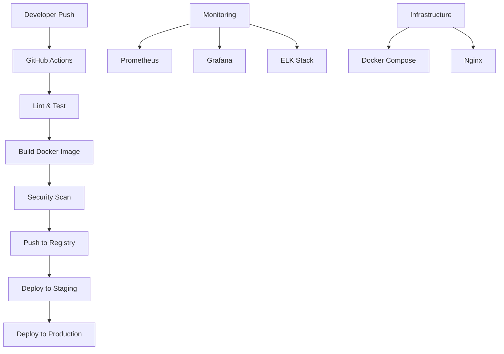

# GoGaze Client CI/CD Guide

This guide covers the complete CI/CD pipeline setup for the GoGaze client application.

## 🏗️ Architecture Overview



## 📋 Prerequisites

### Required Tools
- **Docker** (20.10+)
- **Docker Compose** (2.0+)
- **Node.js** (18+)
- **Git** (2.30+)

### Required Services
- **GitHub Repository** (with Actions enabled)
- **Docker Registry** (Docker Hub, AWS ECR, etc.)
- **Domain & SSL Certificates**

## 🚀 Quick Start

### 1. Environment Setup

```bash
# Clone repository
git clone <your-repo-url>
cd gogaze-client/client

# Install dependencies
npm install

# Copy environment file
cp env.example .env.local
# Edit .env.local with your configuration
```

### 2. Local Development

```bash
# Start development server
npm run dev

# Run tests
npm test

# Run linting
npm run lint

# Build application
npm run build
```

### 3. Docker Development

```bash
# Build Docker image
npm run docker:build

# Run with Docker
npm run docker:run

# Use Docker Compose
npm run docker:compose:up
```

## 🔧 CI/CD Pipeline

### GitHub Actions Workflow

The CI/CD pipeline includes:

#### **1. Lint & Type Check**
- ESLint code quality checks
- TypeScript type checking
- Code formatting validation

#### **2. Testing**
- Unit tests with Jest
- Integration tests
- Coverage reporting
- Test result upload to Codecov

#### **3. Build**
- Next.js application build
- Docker image creation
- Artifact storage

#### **4. Security**
- npm audit for vulnerabilities
- Snyk security scanning
- Dependency vulnerability checks

#### **5. Docker**
- Multi-stage Docker build
- Image optimization
- Registry push with versioning

#### **6. Deployment**
- **Staging**: Automatic deployment on `develop` branch
- **Production**: Manual deployment on `main` branch

### Pipeline Triggers

```yaml
# Automatic triggers
on:
  push:
    branches: [ main, develop ]
  pull_request:
    branches: [ main, develop ]

# Manual triggers
workflow_dispatch:
  inputs:
    environment:
      description: 'Deployment environment'
      required: true
      default: 'staging'
      type: choice
      options:
      - staging
      - production
```

## 🐳 Docker Configuration

### Multi-Stage Build

```dockerfile
# Stage 1: Dependencies
FROM node:18-alpine AS deps
# Install production dependencies only

# Stage 2: Builder
FROM base AS builder
# Build the Next.js application

# Stage 3: Runner
FROM base AS runner
# Final lightweight production image
```

### Docker Compose Services

#### **Development**
```yaml
services:
  gogaze-client:    # Next.js app
  redis:          # Caching
  nginx:          # Reverse proxy
```

#### **Staging**
```yaml
services:
  gogaze-client:    # Next.js app
  redis:           # Caching
  nginx:           # Reverse proxy
  prometheus:      # Monitoring
  grafana:         # Dashboards
```

#### **Production**
```yaml
services:
  gogaze-client:    # Next.js app (3 replicas)
  redis:           # Caching with persistence
  nginx:           # Load balancer + SSL
  prometheus:      # Metrics collection
  grafana:         # Monitoring dashboards
  elasticsearch:   # Log storage
  logstash:        # Log processing
  kibana:          # Log visualization
```

## 🚀 Deployment

### Staging Deployment

```bash
# Deploy to staging
./scripts/deploy.sh staging

# Check status
docker-compose -f docker-compose.staging.yml ps

# View logs
docker-compose -f docker-compose.staging.yml logs -f
```

### Production Deployment

```bash
# Deploy to production
./scripts/deploy.sh production

# Check status
docker-compose -f docker-compose.prod.yml ps

# Monitor logs
docker-compose -f docker-compose.prod.yml logs -f
```


## 📊 Monitoring & Observability

### Metrics Collection

#### **Prometheus**
- Application metrics
- System metrics
- Custom business metrics
- Alert rules configuration

#### **Grafana**
- Real-time dashboards
- Performance monitoring
- Resource utilization
- Custom visualizations

### Log Management

#### **ELK Stack**
- **Elasticsearch**: Log storage and indexing
- **Logstash**: Log processing and transformation
- **Kibana**: Log visualization and analysis

### Health Checks

```yaml
# Application health endpoint
GET /health

# Docker health checks
healthcheck:
  test: ["CMD", "curl", "-f", "http://localhost:3000/health"]
  interval: 30s
  timeout: 10s
  retries: 3
```

## 🔒 Security

### Container Security
- **Non-root user**: Application runs as `nextjs` user
- **Minimal base image**: Alpine Linux for smaller attack surface
- **Security scanning**: Snyk integration for vulnerability detection

### Network Security
- **Rate limiting**: API and upload endpoints
- **SSL/TLS**: HTTPS enforcement
- **Security headers**: XSS, CSRF protection
- **CORS**: Cross-origin request handling

### Secrets Management
```bash
# Environment variables
NEXT_PUBLIC_API_URL=https://api.gogaze.com/api
REDIS_URL=redis://redis:6379

# Docker secrets (using environment variables)
export API_KEY=your-api-key
export REDIS_PASSWORD=your-redis-password
```

## 🚨 Rollback Procedures

### Quick Rollback

```bash
# Rollback to previous version
./scripts/rollback.sh staging

# Rollback to specific version
./scripts/rollback.sh production v1.2.3
```


## 📈 Performance Optimization

### Docker Optimization
- **Multi-stage builds**: Smaller final images
- **Layer caching**: Faster subsequent builds
- **Alpine base**: Minimal resource usage

### Nginx Optimization
- **Gzip compression**: Reduced bandwidth usage
- **Static file caching**: Improved response times
- **Connection pooling**: Better resource utilization

### Application Optimization
- **Next.js optimization**: Automatic code splitting
- **Image optimization**: WebP format support
- **Caching strategies**: Redis for session storage

## 🔧 Troubleshooting

### Common Issues

#### **Build Failures**
```bash
# Check Docker logs
docker-compose logs gogaze-client

# Rebuild without cache
docker-compose build --no-cache
```

#### **Deployment Issues**
```bash
# Check container status
docker-compose ps

# View detailed logs
docker-compose logs -f --tail=100
```

#### **Performance Issues**
```bash
# Check resource usage
docker stats

# Monitor application metrics
curl http://localhost:9090/metrics
```

### Debug Commands

```bash
# Container shell access
docker-compose exec gogaze-client sh

# Check environment variables
docker-compose exec gogaze-client env

# Test database connectivity
docker-compose exec gogaze-client redis-cli ping
```

## 📚 Environment Variables

### Required Variables

```bash
# API Configuration
API_BASE_URL=http://localhost:8000/api
NEXT_PUBLIC_API_URL=http://localhost:8000/api

# Redis Configuration
REDIS_URL=redis://localhost:6379

# Docker Configuration
DOCKER_REGISTRY=your-registry.com
DOCKER_USERNAME=your-username
DOCKER_PASSWORD=your-password

# Monitoring
GRAFANA_PASSWORD=admin
SNYK_TOKEN=your-snyk-token
```

### GitHub Secrets

Configure these secrets in your GitHub repository:

- `DOCKER_USERNAME`: Docker registry username
- `DOCKER_PASSWORD`: Docker registry password
- `API_BASE_URL`: Backend API URL
- `SNYK_TOKEN`: Snyk security token
- `GRAFANA_PASSWORD`: Grafana admin password

## 🎯 Best Practices

### Development
- **Feature branches**: Use feature branches for development
- **Pull requests**: Require PR reviews before merging
- **Testing**: Write tests for new features
- **Documentation**: Update documentation with changes

### Deployment
- **Blue-green deployment**: Zero-downtime deployments
- **Health checks**: Verify application health before traffic
- **Rollback plan**: Always have a rollback strategy
- **Monitoring**: Set up alerts for critical issues

### Security
- **Regular updates**: Keep dependencies updated
- **Vulnerability scanning**: Regular security audits
- **Secrets management**: Use proper secret management
- **Access control**: Limit access to production systems

## 📞 Support

For issues and questions:

1. **Check logs**: Start with application and container logs
2. **Review documentation**: Check this guide and API documentation
3. **GitHub Issues**: Create an issue in the repository
4. **Team communication**: Contact the development team

## 🔄 Continuous Improvement

### Metrics to Track
- **Deployment frequency**: How often you deploy
- **Lead time**: Time from commit to production
- **Mean time to recovery**: How quickly you fix issues
- **Change failure rate**: Percentage of deployments that fail

### Regular Reviews
- **Weekly**: Review deployment metrics
- **Monthly**: Security and performance audits
- **Quarterly**: Architecture and process improvements

---

**Happy Deploying! 🚀**
